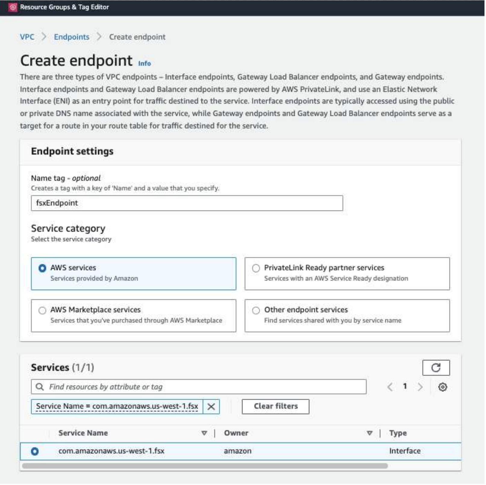
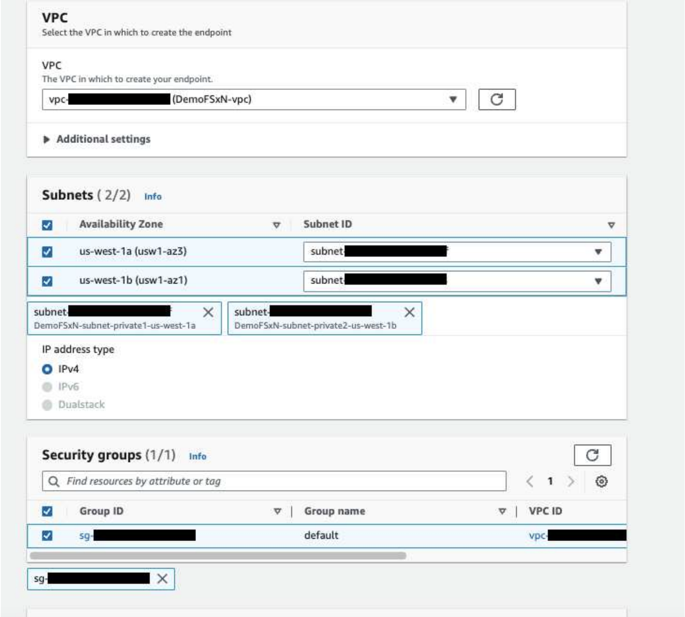
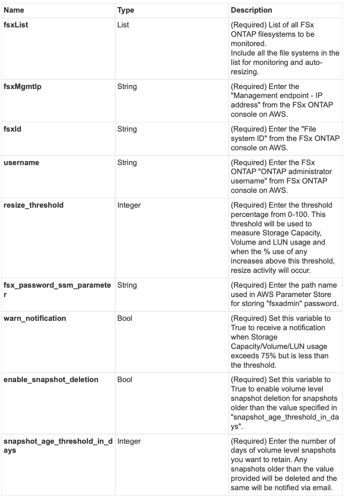

# FSx for ONTAP Monitoring and Auto-Resizing using AWS Lambda Function
FSx for ONTAP is a first party enterprise-grade cloud storage service available on AWS that provides highly reliable, scalable, high-performing and feature-rich file storage built on the popular NetApp ONTAP file system. 

FSx for ONTAP provides seamless deployment and management. No storage expertise is required to get started. To further simplify monitoring, an AWS lamdba function (to automate resizing of total storage capacity, volume size or LUN size based on threshold) can be used.  This document provides a step by step guide to create an automated setup that monitors FSx for ONTAP at regular intervals, notifies and resizes when a user-specified threshold is crossed and notifies the administrator of the resizing activity. 

## License
By accessing, downloading, installing or using the content in this repository, you agree the terms of the License laid out in License file.

Note that there are certain restrictions around producing and/or sharing any derivative works with the content in this repository. Please make sure you read the terms of the License before using the content. If you do not agree to all of the terms, do not access, download or use the content in this repository.

Copyright: 2023 NetApp Inc.

## Features
The solution provides the following features:

* Ability to monitor:
  * Usage of overall Storage Capacity of FSx for ONTAP
  * Usage of each volume (thin provisioned / thick provisioned)
  * Usage of each LUN (thin provisioned / thick provisioned)
* Ability to resize any of the above when a user-defined threshold is breached
* Alerting mechanism to receive usage warning and resizing notifications via email
* Ability to delete snapshots older than user-defined threshold
* Ability to get a list of FlexClone volumes and snapshots associated
* Ability to run the checks at a regular interval
* Ability to use the solution with or without internet access
* Ability to deploy the solution manually or using AWS CloudFormation Template

## Pre-requisites
Before you begin, ensure that the following prerequisites are met: 

* FSx for ONTAP is deployed
* Private subnet with connectivity to FSx for ONTAP
* "fsxadmin" password has been set for FSx for ONTAP


## Solution Architecture and Deployment Guide
The documentation for the solution architecture used and the deployment guidelines are available at https://docs.netapp.com/us-en/netapp-solutions/automation/fsxn_monitoring_resizing_automation.html
### Automated Deployment
Covers single FSx ONTAP filesystem.
Follow the series of steps to complete the automated deployment of this solution:
#### Step 1: Clone the GitHub repository
Clone the GitHub repository on your local system:
  ```
  git clone https://github.com/NetApp/fsxn-monitoring-auto-resizing.git
  ```
#### Step 2: Setup an AWS S3 bucket
    1. Navigate to AWS Console > S3 and click on Create bucket. Create the bucket with the default
settings.
    2. Once inside the bucket, click on Upload > Add files and select Requests.zip from the cloned GitHub repository on your system.
    

#### Step 3: AWS SES SMTP Setup (required if no internet access available)
  Follow this step if you want to deploy the solution without internet access (Note: There will be added costs
  associated with VPC endpoints being set up.)
  1. Navigate to AWS Console > AWS Simple Email Service (SES) > SMTP Settings and click on
  Create SMTP credentials
  2. Enter an IAM User Name or leave it at the default value and click on Create User. Save the SMTP
  user name and SMTP password for further use.
  * Skip this step if SES SMTP setup is already in place.
  

#### Step 4: AWS CloudFormation Deployment
  1. Navigate to AWS Console > CloudFormation > Create stack > With New Resources (Standard).
      ```
      Prepare template: Template is ready
      Specify template: Upload a template file
      Choose file: Browse to the cloned GitHub repo and select fsxn-
      monitoring-solution.yaml
      ```
      
      Click on Next

  2. Enter the stack details. Click on Next and check the checkbox for "I acknowledge that AWS
  CloudFormation might create IAM resources" and click on Submit.
      * If "Does VPC have internet access?" is set to False, "SMTP Username for AWS SES"
      and "SMTP Password for AWS SES" are required. Otherwise, they can be left empty.
      
      
      
      

  3. Once the CloudFormation deployment starts, the email ID mentioned in the "sender email ID" will get
  an email asking them to authorize the use of the email address with AWS SES. Click on the link to
  verify the email address.
  4. Once the CloudFormation stack deployment is completed, if there are any warnings/notifications, an
  email will be sent to the recipient email ID with the notification details.


### Manual Deployment
  Supports monitoring multiple FSx ONTAP filesystems in a single VPC.
Follow the series of steps to complete the manual deployment of this solution:
#### Step 1: Clone the GitHub repository
Clone the GitHub repository on your local system:
  ```
  git clone https://github.com/NetApp/fsxn-monitoring-auto-resizing.git
  ```

#### Step 2: AWS SES SMTP Setup (required if no internet access available)
  Follow this step if you want to deploy the solution without internet access (Note: There will be added costs
  associated with VPC endpoints being set up.)
  1. Navigate to AWS Console > AWS Simple Email Service (SES) > SMTP Settings and click on Create
  SMTP credentials
  2. Enter an IAM User Name or leave it at the default value and click on Create. Save the username and
  password for further use.
  

#### Step 3: Create SSM parameter for fsxadmin password
Navigate to AWS Console > Parameter Store and click on Create Parameter.
  ```
  Name: <Any name/path for storing fsxadmin password>
  Tier: Standard
  Type: SecureString
  KMS key source: My current account
  KMS Key ID: <Use the default one selected>
  Value: <Enter the password for "fsxadmin" user configured on FSx ONTAP>
  ```
  Click on Create parameter.

  Repeat the above steps for all FSx ONTAP filesystems to be monitored.
  

  Perform the same steps for storing smtp username and smtp password if deploying the solution without
  internet access. Otherwise, skip adding these 2 parameters.

#### Step 4: Setup Email Service
Navigate to AWS Console > Simple Email Service (SES) and click on Create Identity.
  ```
  Identity type: Email address
  Email address: <Enter an email address to be used for sending resizing
  notifications>
  ```
  Click on Create identity

  The email ID mentioned in the "sender email ID" will get an email asking the owner to authorize the use of
  the email address with AWS SES. Click on the link to verify the email address.

#### Step 5: Setup VPC Endpoints (required if no internet access is available)

  Required only if deployed without internet access. There will be additional costs associated
with VPC endpoints.
  1. Navigate to AWS Console > VPC > Endpoints and click on Create Endpoint and enter the following
  details:
      ```
      Name: <Any name for the vpc endpoint>
      Service category: AWS Services
      Services: com.amazonaws.<region>.fsx
      vpc: <select the vpc where lambda will be deployed>
      subnets: <select the subnets where lambda will be deployed>
      Security groups: <select the security group>
      Policy: <Either choose Full access or set your own custom policy>
      ```
  Click on Create endpoint.
  
  

  2. Follow the same process for creating SES and SSM VPC endpoints. All parameters remain the same
  as above except Services which will correspond to com.amazonaws.<region>.smtp and
  com.amazonaws.<region>.ssm respectively.

#### Step 6: Create and setup the AWS Lambda Function
  1. Navigate to AWS Console > AWS Lambda > Functions and click on Create function in the same
  region as FSx ONTAP
  2. Use the default Author from scratch and update the following fields:
      ```
      Function name: <Any name of your choice>
      Runtime: Python 3.9
      Architecture: x86_64
      Permissions: Select "Create a new role with basic Lambda
      permissions"
      Advanced Settings:
      Enable VPC: Checked
      VPC: <Choose either the same VPC as FSx ONTAP or a VPC that can
      access both FSx ONTAP and the internet via a private subnet>
      Subnets: <Choose 2 private subnets that have NAT gateway
      attached pointing to public subnets with internet gateway and
      subnets that have internet access>
      Security Group: <Choose a Security Group>
      ```
      Click on Create function.
      
      

  3. Navigate to the newly created Lambda function > Scroll down to the Layers section and click on Add
  a layer.
  
  4. Click on create a new layer under Layer source
  5. Create a Layer and upload Requests.zip file. Select Python 3.9 as the compatible runtime and click on Create.
  

  6. Navigate back to AWS Lambda function > Add Layer > Custom Layers and add the Requests layer.
  
  

  7. Navigate to the Configuration tab of the Lambda function and click on Edit under General
  Configuration. Change the Timeout to 5 mins and click Save.
  8. Navigate to Permissions tab of the Lambda function and click on the role assigned. In the
  permissions tab of the role, click on Add permissions > Create Inline policy.
  a. Click on the JSON tab and paste the contents of the file policy.json from the GitHub repo.
  b. Replace every occurrence of ${AWS::AccountId} with your account ID and click on Review Policy
  c. Provide a Name for the policy and click on Create policy
  9. Copy the contents of fsxn_monitoring_resizing_lambda.py from the git repo to
  lambda_function.py in the AWS Lambda function Code Source section.
  10. Create a new file in the same level as lambda_function.py and name it vars.py and copy the contents
  of vars.py from the git repo to the lambda function vars.py file. Update the variable values in vars.py.
  Reference variable definitions below and click on Deploy:
  
  
  
  
  11. Click on Test, create a test event with an empty JSON object and run the test by clicking Invoke to
  check if the script is running properly.
  12. Once tested successfully, navigate to Configuration > Triggers > Add Trigger.
      ```
      Select a Source: EventBridge
      Rule: Create a new rule
      Rule name: <Enter any name>
      Rule type: Schedule expression
      Schedule expression: <Use "rate(1 day)" if you want the function to
      run daily or add your own cron expression>
      ```
      Click on Add.

      
## Conclusion
With the provided solution, it is easy to set up a monitoring solution that regularly monitors FSx ONTAP
Storage, resizes it based on a user-specified threshold and provides an alerting mechanism. This makes the
process of using and monitoring FSx ONTAP seamless freeing up administrators to focus on business-critical
activities while storage grows automatically when required.
```
Note: The solution is provided as-is. Please test before deploying to production
```

## Author Information

- Dhruv Tyagi - NetApp Solutions Engineering Team
- [Vedant Sethia](mailto:vedant.sethia@netapp.com) - NetApp Solutions Engineering Team
- [Niyaz Mohamed](mailto:niyaz.mohamed@netapp.com) - NetApp Solutions Engineering Team
